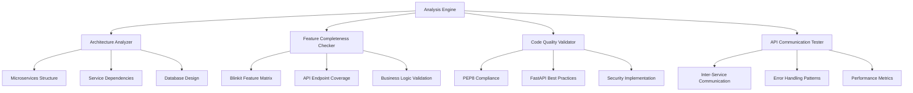

# Blinkit Clone Analysis - Design Document

## Overview

This design document outlines the comprehensive analysis approach for evaluating the Blinkit clone application. The analysis will examine architecture patterns, feature completeness, code quality, and industry standard compliance through systematic evaluation of the codebase, documentation, and implementation patterns.

## Architecture

### Analysis Framework Architecture



### Evaluation Methodology

The analysis will follow a multi-layered approach:

1. **Static Code Analysis**: Examine code structure, patterns, and compliance
2. **Dynamic Testing**: Test API endpoints and service communication
3. **Architecture Review**: Evaluate microservices design and separation
4. **Feature Mapping**: Compare against Blinkit's known functionality
5. **Performance Assessment**: Analyze scalability and efficiency patterns

## Components and Interfaces

### 1. Architecture Analyzer

**Purpose**: Evaluate the microservices architecture and design patterns

**Key Components**:
- Service Dependency Mapper
- Database Schema Analyzer  
- API Gateway Pattern Validator
- Container Orchestration Reviewer

**Analysis Points**:
- Service separation and single responsibility
- Inter-service communication patterns
- Database per service implementation
- Load balancing and scaling strategies

### 2. Feature Completeness Checker

**Purpose**: Verify all core Blinkit features are properly implemented

**Blinkit Core Features Matrix**:
```
Authentication:
├── Phone OTP Login ✓
├── Google OAuth ✓
├── User Profile Management ✓
└── Session Management ✓

Product Catalog:
├── Category Management ✓
├── Product Search & Filter ✓
├── Inventory Tracking ✓
├── Price Management ✓
└── Image Handling ✓

Shopping Experience:
├── Cart Management ✓
├── Real-time Price Updates ✓
├── Quantity Management ✓
└── Cart Persistence ✓

Order Management:
├── Order Creation ✓
├── Status Tracking ✓
├── Payment Integration ❓
├── Order History ✓
└── Cancellation ✓

Delivery System:
├── Partner Management ✓
├── GPS Tracking ✓
├── Real-time Updates ✓
├── Delivery Time Estimation ✓
└── Route Optimization ❓

Notifications:
├── Push Notifications ✓
├── Email Notifications ✓
├── SMS Notifications ✓
└── In-app Notifications ❓

Admin Dashboard:
├── Analytics Dashboard ✓
├── Product Management ✓
├── Order Oversight ✓
├── User Management ✓
└── Delivery Partner Management ✓
```

### 3. Code Quality Validator

**Purpose**: Ensure code follows industry standards and best practices

**Validation Areas**:

#### PEP8 Compliance
- Naming conventions (snake_case for functions/variables, PascalCase for classes)
- Import organization and formatting
- Line length and indentation
- Docstring standards
- Type hints usage

#### FastAPI Best Practices
- Proper dependency injection patterns
- Async/await implementation
- Pydantic model usage
- Response model definitions
- Error handling middleware
- Security middleware implementation

#### Database Best Practices
- SQLAlchemy 2.0 async patterns
- Proper relationship definitions
- Index optimization
- Migration management
- Connection pooling

### 4. API Communication Tester

**Purpose**: Validate inter-service communication and API design

**Testing Scenarios**:
- Authentication flow through API Gateway
- Service-to-service communication patterns
- Error propagation and handling
- Circuit breaker implementation
- Rate limiting effectiveness
- CORS configuration

## Data Models

### Analysis Result Schema

```python
class AnalysisResult(BaseModel):
    overall_score: float
    architecture_score: float
    feature_completeness_score: float
    code_quality_score: float
    api_communication_score: float
    security_score: float
    
    findings: List[Finding]
    recommendations: List[Recommendation]
    missing_features: List[str]
    code_issues: List[CodeIssue]
    
class Finding(BaseModel):
    category: str
    severity: str  # "critical", "major", "minor", "info"
    description: str
    file_path: Optional[str]
    line_number: Optional[int]
    
class Recommendation(BaseModel):
    priority: str  # "high", "medium", "low"
    category: str
    description: str
    implementation_effort: str
    
class CodeIssue(BaseModel):
    type: str  # "pep8", "security", "performance", "logic"
    file_path: str
    line_number: int
    description: str
    suggested_fix: Optional[str]
```

### Microservices Communication Map

```python
class ServiceCommunication(BaseModel):
    source_service: str
    target_service: str
    endpoint: str
    method: str
    authentication_required: bool
    error_handling: bool
    timeout_configured: bool
    retry_logic: bool
```

## Error Handling

### Analysis Error Categories

1. **Architecture Issues**
   - Missing service separation
   - Improper dependency management
   - Database coupling between services
   - Missing API Gateway patterns

2. **Feature Gaps**
   - Missing core Blinkit functionality
   - Incomplete business logic implementation
   - Missing edge case handling
   - Inadequate user experience flows

3. **Code Quality Issues**
   - PEP8 violations
   - Missing type hints
   - Improper async/await usage
   - Security vulnerabilities
   - Performance bottlenecks

4. **Communication Problems**
   - Missing error handling in service calls
   - Improper authentication flow
   - Missing circuit breaker patterns
   - Inadequate logging and monitoring

### Error Reporting Strategy

- **Severity Classification**: Critical, Major, Minor, Info
- **Categorization**: Architecture, Features, Code Quality, Security, Performance
- **Actionable Recommendations**: Specific steps to resolve issues
- **Priority Scoring**: Based on impact and implementation effort

## Testing Strategy

### 1. Static Analysis Testing

**Tools and Approaches**:
- Code structure analysis using AST parsing
- PEP8 compliance checking
- Security vulnerability scanning
- Dependency analysis

**Test Cases**:
- Verify all Python files follow PEP8 naming conventions
- Check for proper async/await usage in database operations
- Validate Pydantic model definitions
- Ensure proper error handling patterns

### 2. Dynamic API Testing

**Test Scenarios**:
- Authentication flow through API Gateway
- CRUD operations for all entities
- Inter-service communication patterns
- Error handling and edge cases
- Rate limiting and security measures

**Test Data**:
- Valid and invalid authentication tokens
- Various product categories and search queries
- Cart operations with different user scenarios
- Order lifecycle testing
- Delivery partner location updates

### 3. Architecture Validation Testing

**Validation Points**:
- Service independence verification
- Database schema separation
- API Gateway routing correctness
- Load balancing configuration
- Container orchestration setup

### 4. Performance Testing

**Metrics to Evaluate**:
- API response times
- Database query performance
- Memory usage patterns
- Concurrent request handling
- Service startup times

## Implementation Approach

### Phase 1: Codebase Scanning
1. Parse all Python files in the project
2. Extract service definitions and dependencies
3. Map API endpoints and their implementations
4. Identify database models and relationships

### Phase 2: Feature Mapping
1. Compare implemented features against Blinkit feature matrix
2. Test critical user journeys
3. Validate business logic completeness
4. Check for missing functionality

### Phase 3: Quality Assessment
1. Run PEP8 compliance checks
2. Validate FastAPI best practices
3. Check security implementation
4. Assess error handling patterns

### Phase 4: Communication Testing
1. Test inter-service API calls
2. Validate authentication flows
3. Check error propagation
4. Assess monitoring and logging

### Phase 5: Report Generation
1. Compile findings and recommendations
2. Generate detailed analysis report
3. Provide actionable improvement suggestions
4. Create implementation roadmap for fixes

## Success Criteria

### Perfect Blinkit Clone Criteria

1. **Architecture Excellence** (Score: 90%+)
   - Proper microservices separation
   - Clean API design
   - Scalable database architecture
   - Effective caching strategy

2. **Feature Completeness** (Score: 95%+)
   - All core Blinkit features implemented
   - Proper business logic
   - Complete user journeys
   - Edge case handling

3. **Code Quality** (Score: 90%+)
   - PEP8 compliance
   - FastAPI best practices
   - Proper error handling
   - Security implementation

4. **API Communication** (Score: 90%+)
   - Reliable inter-service communication
   - Proper authentication flow
   - Error handling and recovery
   - Performance optimization

### Overall Assessment Scale

- **95-100%**: Perfect Blinkit Clone - Production Ready
- **85-94%**: Excellent Implementation - Minor improvements needed
- **75-84%**: Good Implementation - Some gaps to address
- **65-74%**: Adequate Implementation - Significant improvements required
- **Below 65%**: Incomplete Implementation - Major work needed

This comprehensive design ensures thorough evaluation of the Blinkit clone against industry standards and the original platform's functionality.