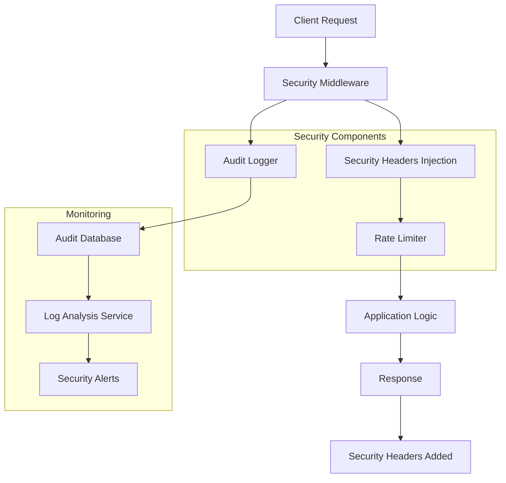
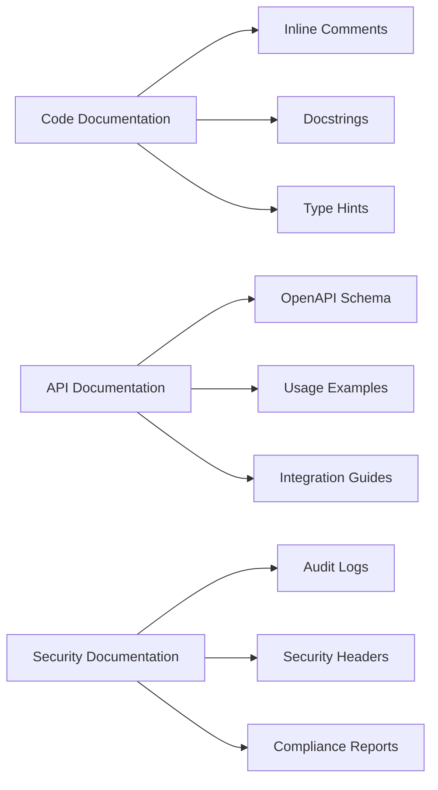

# Security & Documentation Improvements - Design Document

## Overview

This design document outlines the technical approach for enhancing the GroFast application with comprehensive inline code documentation, security hardening through headers and audit logging, and detailed API documentation. The improvements will enhance maintainability, security posture, and developer experience.

## Architecture

### Security Enhancement Architecture



### Documentation Enhancement Strategy



## Components and Interfaces

### 1. Security Middleware Enhancement

**Purpose**: Implement comprehensive security headers and request/response security processing

**Components**:
- Security Headers Middleware
- Content Security Policy (CSP) Manager
- CORS Security Enhancement
- Request Validation Layer

**Implementation Strategy**:
```python
class SecurityHeadersMiddleware:
    """
    Comprehensive security headers middleware that adds multiple layers
    of protection against common web vulnerabilities including XSS,
    clickjacking, and content type sniffing attacks.
    """
    
    def __init__(self, app: FastAPI):
        self.app = app
        self.csp_policy = self._build_csp_policy()
    
    async def __call__(self, request: Request, call_next):
        # Process request through security layers
        response = await call_next(request)
        
        # Add comprehensive security headers
        self._add_security_headers(response)
        return response
```

### 2. Audit Logging System

**Purpose**: Comprehensive audit trail for security events and user actions

**Data Models**:
```python
class AuditLog(Base):
    """
    Comprehensive audit logging model that tracks all security-relevant
    events including authentication, data access, and system changes.
    
    Attributes:
        event_type: Type of event (AUTH, DATA_ACCESS, SYSTEM_CHANGE)
        user_id: ID of the user performing the action
        ip_address: Source IP address of the request
        user_agent: Browser/client information
        endpoint: API endpoint accessed
        method: HTTP method used
        request_data: Sanitized request payload (sensitive data removed)
        response_status: HTTP response status code
        timestamp: When the event occurred
        session_id: Session identifier for correlation
        risk_score: Calculated risk score for the event
    """
    __tablename__ = "audit_logs"
    
    id = Column(Integer, primary_key=True, index=True)
    event_type = Column(Enum(AuditEventType), nullable=False, index=True)
    user_id = Column(Integer, ForeignKey("users.id"), index=True)
    ip_address = Column(String(45), nullable=False, index=True)  # IPv6 support
    user_agent = Column(Text)
    endpoint = Column(String(255), nullable=False, index=True)
    method = Column(String(10), nullable=False)
    request_data = Column(JSON)  # Sanitized request data
    response_status = Column(Integer, nullable=False, index=True)
    timestamp = Column(DateTime(timezone=True), server_default=func.now(), index=True)
    session_id = Column(String(255), index=True)
    risk_score = Column(Integer, default=0, index=True)
    metadata = Column(JSON)  # Additional context data
```

**Audit Event Types**:
```python
class AuditEventType(enum.Enum):
    """
    Enumeration of all auditable events in the system.
    Each event type has specific logging requirements and risk levels.
    """
    # Authentication Events
    LOGIN_SUCCESS = "login_success"
    LOGIN_FAILURE = "login_failure"
    LOGOUT = "logout"
    TOKEN_REFRESH = "token_refresh"
    PASSWORD_CHANGE = "password_change"
    
    # Data Access Events
    USER_DATA_ACCESS = "user_data_access"
    SENSITIVE_DATA_VIEW = "sensitive_data_view"
    BULK_DATA_EXPORT = "bulk_data_export"
    
    # System Events
    ADMIN_ACTION = "admin_action"
    CONFIGURATION_CHANGE = "config_change"
    SYSTEM_ERROR = "system_error"
    
    # Security Events
    RATE_LIMIT_EXCEEDED = "rate_limit_exceeded"
    SUSPICIOUS_ACTIVITY = "suspicious_activity"
    SECURITY_VIOLATION = "security_violation"
```

### 3. Enhanced API Documentation System

**Purpose**: Comprehensive API documentation with examples and integration guides

**Documentation Structure**:
```python
class APIDocumentationEnhancer:
    """
    Enhances FastAPI's automatic documentation generation with
    comprehensive examples, use cases, and integration guides.
    """
    
    @staticmethod
    def add_comprehensive_examples(app: FastAPI):
        """
        Adds detailed examples to all API endpoints including:
        - Multiple request scenarios
        - Complete response examples
        - Error handling examples
        - Integration workflow examples
        """
        pass
    
    @staticmethod
    def generate_integration_guides():
        """
        Generates step-by-step integration guides for:
        - Authentication flows
        - Complete user journeys
        - Real-time features
        - Error handling strategies
        """
        pass
```

### 4. Code Documentation Standards

**Docstring Template**:
```python
def example_service_method(self, param1: str, param2: Optional[int] = None) -> Dict[str, Any]:
    """
    Brief description of what this method does.
    
    This method performs [specific business logic] by [explanation of approach].
    It handles [edge cases] and ensures [data consistency/security requirements].
    
    Args:
        param1 (str): Description of parameter including valid values and constraints.
                     Example: "user_email" must be a valid email format.
        param2 (Optional[int]): Description of optional parameter and default behavior.
                               Defaults to None, which means [default behavior].
    
    Returns:
        Dict[str, Any]: Description of return value structure.
            {
                "success": bool,  # Indicates operation success
                "data": Any,      # The actual result data
                "message": str    # Human-readable status message
            }
    
    Raises:
        HTTPException: When [specific condition] occurs.
        ValidationError: When input parameters are invalid.
        DatabaseError: When database operation fails.
    
    Example:
        >>> service = UserService()
        >>> result = service.example_method("user@example.com", 123)
        >>> print(result["success"])
        True
    
    Note:
        This method is thread-safe and can be called concurrently.
        Performance: O(1) for cache hits, O(n) for database queries.
    """
```

## Security Implementation Details

### 1. Security Headers Configuration

```python
SECURITY_HEADERS = {
    # Prevent XSS attacks
    "X-Content-Type-Options": "nosniff",
    
    # Prevent clickjacking
    "X-Frame-Options": "DENY",
    
    # Enable XSS protection
    "X-XSS-Protection": "1; mode=block",
    
    # Enforce HTTPS
    "Strict-Transport-Security": "max-age=31536000; includeSubDomains; preload",
    
    # Control referrer information
    "Referrer-Policy": "strict-origin-when-cross-origin",
    
    # Permissions policy
    "Permissions-Policy": "geolocation=(), microphone=(), camera=()",
    
    # Content Security Policy
    "Content-Security-Policy": (
        "default-src 'self'; "
        "script-src 'self' 'unsafe-inline' https://apis.google.com; "
        "style-src 'self' 'unsafe-inline' https://fonts.googleapis.com; "
        "font-src 'self' https://fonts.gstatic.com; "
        "img-src 'self' data: https:; "
        "connect-src 'self' https://api.supabase.co wss://realtime.supabase.co; "
        "frame-ancestors 'none'; "
        "base-uri 'self'; "
        "form-action 'self'"
    )
}
```

### 2. Audit Logging Implementation

```python
class AuditLogger:
    """
    Centralized audit logging service that captures all security-relevant
    events with proper sanitization and risk assessment.
    """
    
    def __init__(self, db_session: AsyncSession):
        self.db = db_session
        self.risk_calculator = RiskCalculator()
    
    async def log_event(
        self,
        event_type: AuditEventType,
        request: Request,
        user_id: Optional[int] = None,
        additional_data: Optional[Dict] = None
    ) -> None:
        """
        Logs an audit event with comprehensive context information.
        
        This method captures all relevant information about a security event
        while ensuring sensitive data is properly sanitized before storage.
        
        Args:
            event_type: The type of event being logged
            request: The FastAPI request object containing context
            user_id: ID of the user performing the action (if authenticated)
            additional_data: Any additional context data to include
        
        Security Considerations:
            - Sensitive data (passwords, tokens) is automatically sanitized
            - IP addresses are logged for security analysis
            - Request payloads are sanitized to remove PII
        """
        # Sanitize request data to remove sensitive information
        sanitized_data = self._sanitize_request_data(request, additional_data)
        
        # Calculate risk score based on event type and context
        risk_score = self.risk_calculator.calculate_risk(
            event_type, request, user_id
        )
        
        # Create audit log entry
        audit_entry = AuditLog(
            event_type=event_type,
            user_id=user_id,
            ip_address=self._get_client_ip(request),
            user_agent=request.headers.get("user-agent", ""),
            endpoint=str(request.url.path),
            method=request.method,
            request_data=sanitized_data,
            response_status=200,  # Will be updated by middleware
            session_id=getattr(request.state, 'session_id', None),
            risk_score=risk_score,
            metadata=self._extract_metadata(request)
        )
        
        # Store in database asynchronously
        self.db.add(audit_entry)
        await self.db.commit()
        
        # Trigger alerts for high-risk events
        if risk_score > 80:
            await self._trigger_security_alert(audit_entry)
```

## API Documentation Enhancement

### 1. Comprehensive Endpoint Documentation

```python
@router.post(
    "/auth/verify-otp",
    response_model=UserResponse,
    summary="Verify OTP and authenticate user",
    description="""
    Verifies a Firebase OTP token and creates or retrieves the user account.
    
    This endpoint handles the complete OTP verification flow:
    1. Validates the Firebase ID token
    2. Extracts user information from the token
    3. Creates a new user account if it doesn't exist
    4. Returns user information and session details
    
    **Security Features:**
    - Rate limited to 10 requests per minute per IP
    - Firebase token validation with signature verification
    - Automatic session creation with Redis storage
    - Audit logging for all authentication attempts
    
    **Business Logic:**
    - New users are automatically created with basic profile information
    - Existing users have their last login timestamp updated
    - FCM tokens are updated for push notification delivery
    """,
    responses={
        200: {
            "description": "OTP verification successful",
            "content": {
                "application/json": {
                    "example": {
                        "id": 123,
                        "firebase_uid": "abc123def456",
                        "name": "John Doe",
                        "email": "john@example.com",
                        "phone": "+1234567890",
                        "is_active": True,
                        "created_at": "2024-01-15T10:30:00Z"
                    }
                }
            }
        },
        400: {
            "description": "Invalid OTP token",
            "content": {
                "application/json": {
                    "example": {
                        "detail": "Invalid Firebase ID token",
                        "error_code": "INVALID_TOKEN",
                        "request_id": "req_123456789"
                    }
                }
            }
        },
        429: {
            "description": "Rate limit exceeded",
            "content": {
                "application/json": {
                    "example": {
                        "detail": "Rate limit exceeded",
                        "request_id": "req_123456789",
                        "retry_after": 60
                    }
                }
            }
        }
    },
    tags=["Authentication"]
)
async def verify_otp(
    request: OTPVerifyRequest,
    db: AsyncSession = Depends(get_db),
    audit_logger: AuditLogger = Depends(get_audit_logger)
):
    """
    Verify Firebase OTP and create/get user.
    
    Example Usage:
    ```python
    import requests
    
    # Verify OTP token
    response = requests.post(
        "https://api.grofast.com/auth/verify-otp",
        json={
            "firebase_id_token": "eyJhbGciOiJSUzI1NiIs..."
        },
        headers={"Content-Type": "application/json"}
    )
    
    if response.status_code == 200:
        user_data = response.json()
        print(f"Welcome {user_data['name']}!")
    ```
    
    JavaScript Example:
    ```javascript
    const verifyOTP = async (idToken) => {
        try {
            const response = await fetch('/auth/verify-otp', {
                method: 'POST',
                headers: {
                    'Content-Type': 'application/json',
                },
                body: JSON.stringify({
                    firebase_id_token: idToken
                })
            });
            
            if (response.ok) {
                const userData = await response.json();
                console.log('User authenticated:', userData);
                return userData;
            }
        } catch (error) {
            console.error('Authentication failed:', error);
        }
    };
    ```
    """
```

### 2. Integration Workflow Examples

```markdown
# Complete Order Workflow Example

## 1. User Authentication
```bash
curl -X POST "https://api.grofast.com/auth/verify-otp" \
  -H "Content-Type: application/json" \
  -d '{
    "firebase_id_token": "eyJhbGciOiJSUzI1NiIs..."
  }'
```

## 2. Browse Products
```bash
curl -X GET "https://api.grofast.com/products?category=groceries&limit=20" \
  -H "Authorization: Bearer YOUR_TOKEN"
```

## 3. Add Items to Cart
```bash
curl -X POST "https://api.grofast.com/cart/add" \
  -H "Authorization: Bearer YOUR_TOKEN" \
  -H "Content-Type: application/json" \
  -d '{
    "product_id": 123,
    "quantity": 2
  }'
```

## 4. Create Order
```bash
curl -X POST "https://api.grofast.com/orders/create" \
  -H "Authorization: Bearer YOUR_TOKEN" \
  -H "Content-Type: application/json" \
  -d '{
    "delivery_address": "123 Main St, City, State 12345",
    "delivery_latitude": "40.7128",
    "delivery_longitude": "-74.0060",
    "payment_method": "card",
    "notes": "Please ring doorbell"
  }'
```

## 5. Track Order Status
```bash
curl -X GET "https://api.grofast.com/orders/ORDER_ID" \
  -H "Authorization: Bearer YOUR_TOKEN"
```
```

## Implementation Approach

### Phase 1: Security Hardening
1. Implement comprehensive security headers middleware
2. Create audit logging system with database schema
3. Add security event detection and alerting
4. Implement request/response sanitization

### Phase 2: Code Documentation
1. Add comprehensive docstrings to all service methods
2. Enhance model documentation with field explanations
3. Add inline comments for complex business logic
4. Create code examples and usage patterns

### Phase 3: API Documentation Enhancement
1. Enhance OpenAPI schema with detailed examples
2. Create comprehensive integration guides
3. Add workflow documentation for complete user journeys
4. Implement interactive API documentation

### Phase 4: Monitoring and Alerting
1. Set up security event monitoring
2. Implement automated alerting for suspicious activities
3. Create compliance reporting dashboards
4. Add performance monitoring for security components

## Success Criteria

### Security Enhancement Success Metrics
- **Security Headers Coverage**: 100% of responses include all required security headers
- **Audit Log Coverage**: 100% of security-relevant events are logged
- **Alert Response Time**: Security alerts triggered within 30 seconds of detection
- **Compliance Score**: 95%+ compliance with security standards

### Documentation Quality Metrics
- **Code Documentation Coverage**: 90%+ of public methods have comprehensive docstrings
- **API Documentation Completeness**: 100% of endpoints have examples and use cases
- **Developer Onboarding Time**: Reduced by 50% with improved documentation
- **Integration Success Rate**: 95%+ successful integrations using documentation

This comprehensive design ensures the application meets enterprise-level security and documentation standards while maintaining performance and usability.